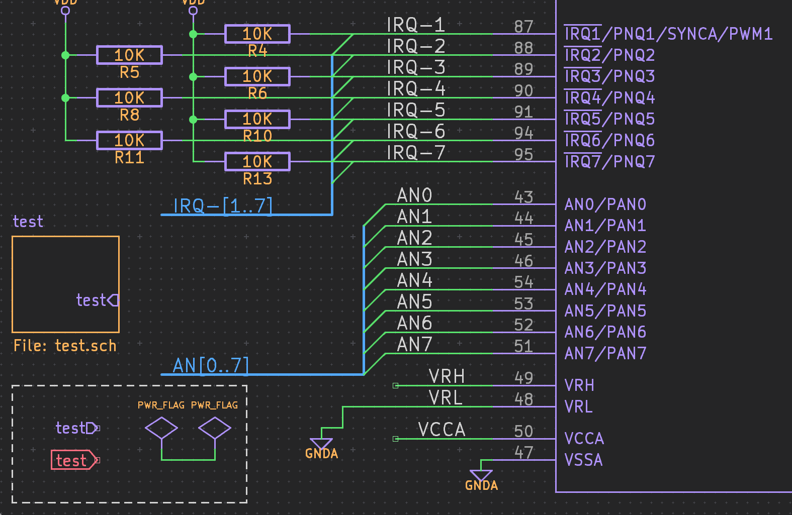
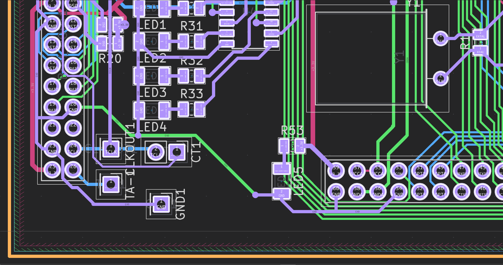

# Arcana - KiCad Theme

Arcana is a theme I personally use on KiCad, but I figured others might enjoy it as well, it has no relation to the show by the same name.

<table>
	<tbody>
		<tr>
			<td></td>
			<td></td>
		</tr>
	</tbody>
</table>

## License

The Arcana color scheme for KiCad is licensed under the [CC BY-NC-SA 4.0](https://creativecommons.org/licenses/by-nc-sa/4.0/deed.en), the full text of which can be found in the [LICENSE](./LICENSE) file.
